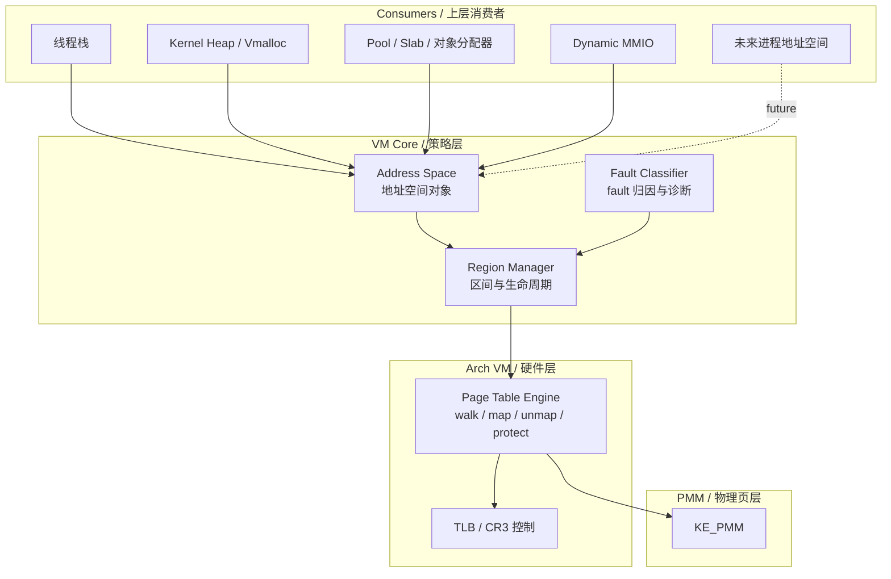
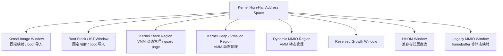
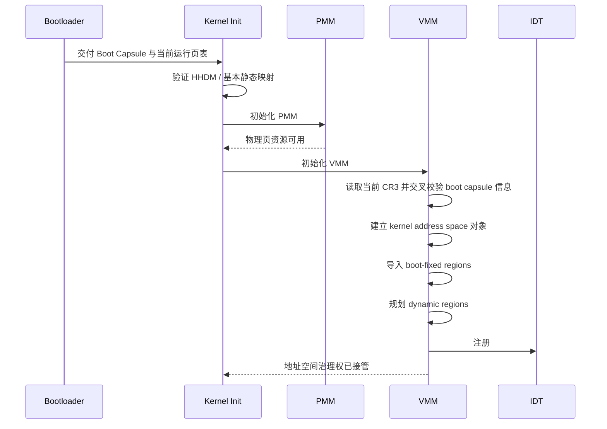
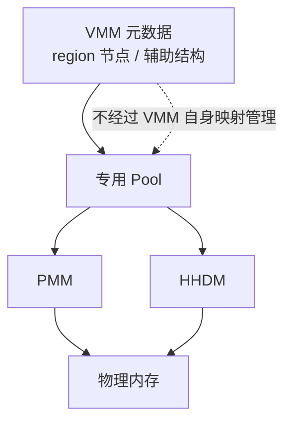
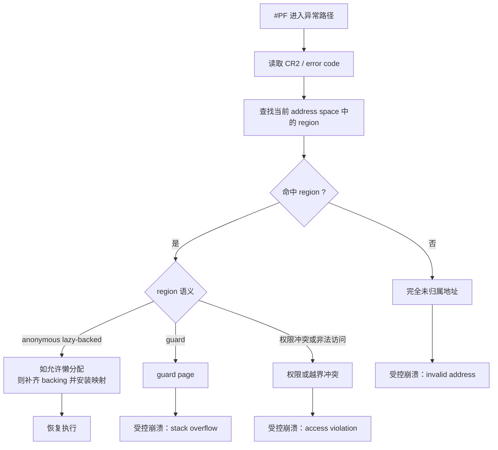
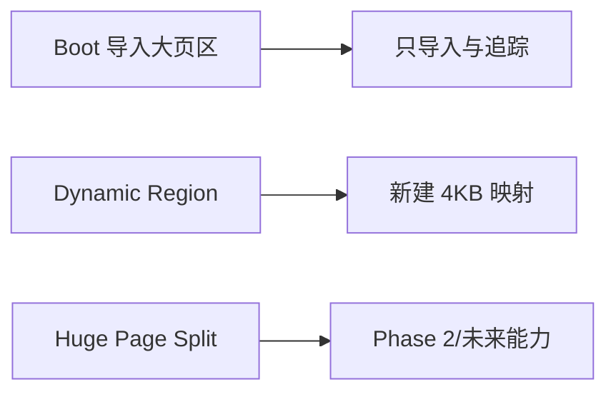
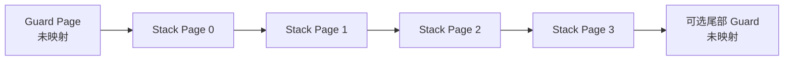
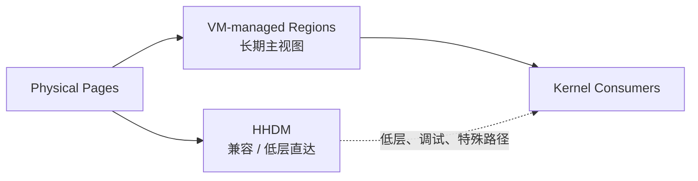
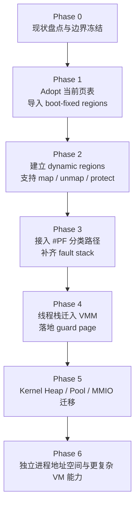

# HimuOS VMM 完整设计

## 1. 文档定位

本文档是 HimuOS 虚拟内存管理器方案的最终融合版设计稿。

它吸收了两类优点：

- 保留“从当前系统边界出发、先明确职责与阶段目标”的立项视角。
- 吸收“把真正困难的工程问题提前拆开说明”的实施视角。

因此，本文档的写法有两个明确原则：

1. **冻结架构，不冻结表面 API。**
   文中会给出推荐的模块形态、对象语义和实现顺序，但不把函数名、文件名、字段名过早写死。
2. **把难点讲具体，把承诺讲克制。**
   尤其是 boot 页表接管、巨页策略、`#PF` 路径、栈模型迁移、HHDM 共存、元数据自举这些点，会讲到足以指导工程落地，但不会把未来演进空间堵死。

> 注：文中出现的对象名，如 `Address Space`、`Region`、`Page Table Engine` 等，均应视为**概念名**或**推荐命名方向**，不是最终必须采用的代码标识符。

---

## 2. 设计结论先行

HimuOS 当前最适合引入的，不是一个“大而全”的 demand-paging 子系统，而是一套 **以内核地址空间为中心的 VMM**。

它的第一阶段使命不是“分页技巧更多”，而是把以下权力收回来：

- 页表由谁拥有
- 一段虚拟区间由谁创建、修改、释放
- 线程栈和内核堆应当长在哪一类地址空间里
- 发生 `#PF` 时，错误该由谁解释

最终建议如下：

- `PMM` 继续只做物理页资源管理。
- 新增 `Arch VM` 层负责 x86_64 页表硬件操作。
- 新增 `VM Core` 层负责地址空间、region、生命周期和 fault 分类。
- `HHDM` 保留，但从“默认承载所有内核对象的主视图”降级为“兼容窗口 + 低层直达窗口”。
- 第一批迁入 VMM 的消费者，应是 **线程栈**，其次是 **kernel heap / vmalloc**，再其次是 **dynamic MMIO**。

一句话总结：

**VMM 在 HimuOS 中首先是“地址空间治理器”，其次才是“分页特性承载者”。**

---

## 3. 当前系统现实与边界

### 3.1 当前已经存在的能力

HimuOS 当前不是“没有虚拟内存”，而是“已经有可运行的虚拟地址空间，但缺少运行时治理层”。

当前系统已经具备：

- Bootloader 构建 long mode 页表并切入内核。
- 初始地址空间已包含：
  - 低 2GB identity map
  - 完整 HHDM
  - 固定高半区内核镜像映射
  - boot stack / IST 映射
  - framebuffer / 若干 MMIO 映射
- 内核进入后会验证 HHDM，再初始化 `KE_PMM`。
- `KE_PMM` 已经稳定承担物理页分配、释放、保留和统计，不负责完整 VM。
- `KE_POOL`、线程栈、部分设备访问仍主要通过 `PMM alloc + HHDM_PHYS2VIRT(pa)` 直接使用内存。

### 3.2 当前模式的核心问题

这种模式在 bring-up 期非常实用，但它有 5 个系统性短板：

| 短板 | 当前表现 | 长期影响 |
|------|----------|----------|
| 页表无运行时治理 | boot 后页表基本成为“化石” | 无法优雅地新增/删除/保护映射 |
| 虚拟区间无 owner | 映射生命周期散落在各子系统 | 难以统一解释 fault 和释放责任 |
| HHDM 过度承担主视图 | 物理页经常直接被当成对象地址 | 栈、heap、MMIO 很难受控演进 |
| 栈模型混用 | boot 固定栈与 HHDM 栈并存 | guard page 与 TSS 语义不收敛 |
| `#PF` 缺少 VM 解释层 | page fault 只能作为崩溃结果 | 无法区分 guard、权限错、hole、lazy map |

### 3.3 这意味着什么

VMM 在 HimuOS 中不应被定义为：

- “把所有内存子系统推翻重写”
- “一步到位做 demand paging / COW / 用户态 VM”
- “立刻消灭 HHDM”

VMM 应被定义为：

- 页表与地址空间的**所有者**
- 映射生命周期的**统一治理点**
- PMM 与上层消费者之间的**稳定中层**

---

## 4. 设计目标与非目标

### 4.1 第一阶段目标

第一阶段 VMM 的目标是：

1. 接管当前内核地址空间，而不是推翻现有启动路径。
2. 明确 boot 建立的静态映射、运行时动态映射、特殊兼容窗口之间的边界。
3. 为运行时新增/删除/修改映射提供统一入口。
4. 为线程栈提供真实 guard page，而不是仅靠注释宣称。
5. 为 kernel heap / vmalloc / MMIO 建立未来可扩展的基础。
6. 为 `#PF` 提供可解释、可诊断、可归因的元数据支撑。
7. 为未来的用户态地址空间预留清晰分层，而不是抢先实现。

### 4.2 第一阶段非目标

第一阶段明确不追求：

- swap / pager / page out
- 文件映射
- copy-on-write
- 复杂 huge-page 优化
- NUMA / zone / per-CPU memory policy
- 完整 SMP shootdown 体系
- 一步到位剥离 HHDM

### 4.3 一条重要策略

第一阶段应优先建设：

- **地址空间所有权**
- **region 元数据**
- **页表操作边界**
- **故障解释能力**

而不是优先建设：

- 高级分页特性
- 激进地址空间重排

---

## 5. 总体架构

### 5.1 分层职责

#### PMM

PMM 的职责保持不变：

- 只管理物理页资源
- 不理解虚拟区间
- 不理解页表语义
- 不承载线程栈、heap、MMIO 的地址空间策略

#### Arch VM

这是唯一直接理解 x86_64 页表硬件的层，负责：

- 页表 walk
- 建立/拆除/查询/修改映射
- 中间页表页的分配
- TLB invalidation
- 后续扩展到多核 shootdown

它只回答“怎么改页表”，不回答“为什么这样改页表”。

#### VM Core

这是新的策略中心，负责：

- 地址空间对象
- region 记录与查找
- 动态 VA 规划
- boot 映射导入
- 映射生命周期管理
- page fault 的解释与归因

#### Consumers

上层逐步从：

`拿到物理页 -> HHDM_PHYS2VIRT -> 直接使用`

迁移到：

`申请受控虚拟区间 -> VM 决定 backing -> 使用稳定 VA`

---

## 6. 设计原则

### 6.1 单向依赖

依赖关系应保持：

`Consumers -> VM -> Arch VM -> PMM`

反向不成立。

### 6.2 零循环依赖

VMM 自己的元数据不能通过 VMM 自己分配，否则 page fault / map path 会形成递归。

因此建议：

- VMM 元数据节点来自专用 pool
- 该 pool 继续走 `KE_POOL -> PMM -> HHDM` 路径
- VMM 的元数据访问始终不依赖“自己先把自己映射好”

### 6.3 HHDM 共存但降级

HHDM 在第一阶段继续存在，但必须重新定义其角色：

- 是兼容窗口
- 是 bring-up / 调试窗口
- 是页表页、PMM 元数据等低层对象的直达窗口

而不是：

- 普通内核对象长期默认地址空间

### 6.4 先导入，再收敛

VMM 第一阶段的重心是：

- adopt 当前地址空间
- 导入静态映射元数据
- 在现有高半区中打开新动态区域

不是：

- 先重做整个页表再切换

### 6.5 渐进式收益优先

最先迁入 VMM 的对象应是收益最大、边界最清晰的对象：

1. 线程栈
2. kernel heap / vmalloc
3. dynamic MMIO

---

## 7. 内核地址空间规划

### 7.1 总体布局

建议保留现有固定窗口语义稳定，不在引入 VMM 时大规模重排地址空间。
VMM 在这些稳定窗口之间或之后引入自身管理的动态区域。

### 7.2 区域角色说明

| 区域 | 角色 | 第一阶段策略 |
|------|------|--------------|
| Kernel Image Window | 承载内核代码和数据 | 作为 `boot-fixed` region 导入并长期保留 |
| Boot Stack / IST Window | 现有 boot 栈与异常栈 | 导入追踪，不急于迁移地址 |
| Kernel Stack Region | 线程栈主承载区 | 作为第一批 VM-native 消费者落地 |
| Kernel Heap / Vmalloc | 页粒度动态虚拟区间 | 作为 heap/slab/pool 的后续后端 |
| Dynamic MMIO | 设备寄存器/窗口映射 | 用于运行时 map/unmap 受控接入 |
| HHDM | 兼容窗口和低层直达 | 保留但降级，不继续扩张其职责 |
| Legacy MMIO | 现有 framebuffer 等静态映射 | 先导入追踪，后续视情况迁移 |

### 7.3 Lower 2GB Identity Map 的态度

当前 lower 2GB identity mapping 属于 bootstrap 遗留资产，不应视为长期内核模型的一部分。

建议策略：

- **第一步**：尽快 unmap 第 0 页，保证 NULL dereference 能触发 `#PF`。
- **第二步**：对整个 lower 2GB identity mapping 做依赖审计。
- **第三步**：确认无依赖后，再逐步回收非必要 identity 区间。

这部分不应作为 VMM 上线前置条件，但必须在设计中明确为“bootstrap-only”资产，而不是长期契约。

---

## 8. 核心抽象

### 8.1 Address Space

Address Space 至少需要表达：

- 根页表身份
- 该地址空间中的 region 集合
- 动态 VA 分配状态
- fault 查找上下文

在第一阶段，系统仅有一个全局的 **kernel address space**。

未来引入用户态后：

- lower-half 归每个进程独立拥有
- kernel half 由全局内核映射策略共享

### 8.2 Region

Region 是 VMM 的基本管理单元。

一段 region 至少应表达：

- 基址与页数
- 访问权限
- backing 类型
- 生命周期/owner
- 是否允许懒分配
- 是否为 guard
- 是否为 boot 导入

建议的 backing 分类如下：

| backing 类型 | 语义 | 典型场景 |
|-------------|------|----------|
| `boot-fixed` | boot 已建立，VMM 只追踪 | kernel image / boot stack / HHDM |
| `anonymous-owned` | VMM 自己拥有 backing | 线程栈 / kernel heap 页 |
| `physical-explicit` | 明确映射到指定 PA | MMIO / 设备窗口 |
| `direct-map-special` | 特殊兼容窗口 | HHDM |

### 8.3 Mapping Policy

Region 级策略至少应能表达：

- `read`
- `write`
- `execute`
- `user/supervisor`
- `cacheability`
- `guard`
- `wired/pinned`
- `boot-imported`

这里的重点不是一开始把 flag 体系做得多复杂，而是让这些语义有安放位置。

### 8.4 Page Table Engine

Page Table Engine 是 Arch VM 的核心，负责：

- 单页级 map/unmap/query/protect
- 中间页表分配
- 页表项属性翻译
- TLB invalidation

推荐实现约束：

- 第一阶段动态映射以 **4KB granularity** 为主。
- 动态区默认不依赖拆分 boot 巨页。
- 对 boot 导入的大页只做追踪，不主动重写。

---

## 9. Bootstrap 接管方案

### 9.1 结论

VMM 第一阶段采用 **adopt current CR3**，而不是“先 clone 再切换”的方式。

这意味着：

- 当前 bootloader 建好的地址空间继续作为运行基底
- VMM 先认领它，再在其上演进

### 9.2 为什么 adopt 更适合当前 HimuOS

因为当前系统已经：

- 依赖 HHDM 成功运行
- 已经从 boot capsule 拿到关键物理地址信息
- 已有 PMM 可用于后续中间页表页分配

如果此时强行先重建页表，风险会集中在：

- 导入范围遗漏
- 属性翻译错误
- 切换时机错误
- boot 特殊映射未完整复制

相比之下，adopt 模式的主要风险仅是：

- 静态映射元数据导入不完整

这个风险更容易审计、验证和修正。

### 9.3 推荐初始化时序

### 9.4 boot-fixed region 导入清单

第一阶段建议至少导入并追踪以下静态映射：

- 内核镜像
- boot stack
- IST stack
- HHDM
- framebuffer / legacy MMIO
- ACPI 映射区
- boot capsule 自身
- 当前页表页所在物理区间
- 仍被 early kernel 依赖的其他固定映射

### 9.5 何时再重建 root page table

只有在以下条件成立时，才建议进入 reroot / rebuild：

- Page Table Engine 已稳定工作
- 动态 region 管理稳定
- `#PF` 基本分类已可用
- boot 关键映射的 owner 与生命周期已清楚
- 已明确哪些 boot 页表页可以释放

这一步应被视为 **第二阶段收敛动作**，不应作为第一阶段上线条件。

---

## 10. 一个最容易忽略但必须先讲清的点：元数据自举

VMM 的难点之一，是“谁来给 VMM 的元数据分配内存”。

如果处理不好，就会出现：

- VMM 为了分配 region 节点，需要先使用 VMM 自己
- `#PF` 为了查 region，需要先分配新的 region / fault 结构
- map path 和 alloc path 相互递归

推荐原则：

- VMM 元数据走 **专用 pool**
- 该 pool 继续依赖 **PMM + HHDM**
- VMM 初始化早期就把这条元数据分配路径准备好

这条约束很关键，因为它决定了第一阶段的 VMM 可以在 fault path 和 map path 中保持可解释性，而不轻易陷入自举死循环。

---

## 11. Page Fault 设计

### 11.1 第一阶段的定位

`#PF` 在第一阶段首先是一个 **分类器与诊断器**，其次才可能是一个有限的“懒补齐器”。

也就是说，第一阶段最低要求是：

- 知道 fault address 属于哪个 region
- 知道这个 region 的语义是什么
- 知道这是：
  - hole
  - guard
  - 权限冲突
  - boot-fixed 非法访问
  - 可选的 lazy-backed anonymous fault

### 11.2 `#PF` 独立栈问题

这是另一处不能含糊的硬问题。

如果线程栈命中 guard page，本质上说明当前线程栈已经不可继续安全使用。
这时如果 `#PF` handler 仍然跑在原线程栈上，极易升级成 `#DF`。

#### 推荐方向

为 `#PF` 提供独立 fault stack。

当前代码里：

- `#DF` 已经走 IST1
- TSS 结构里存在 IST2 及更高槽位
- 但现有 boot 初始化只明确填充了 `IST1`

因此工程上建议：

- 在引入 VMM 时同步补齐一个额外 fault stack
- 优先使用 `IST2` 承载 `#PF`
- 若实现时发现 boot capsule/CPU local data 生命周期需要调整，则以“新增 early fault stack + 更新 TSS”为准

这属于 **实施级必须解决的问题**，但文档不强制它一定由哪个模块、在哪个文件里完成。

### 11.3 `#PF` 重入性

第一阶段不应假设 `#PF` path 永远不会再 fault。

建议策略：

- 元数据访问路径尽量依赖已知稳定映射
- 入口处设置重入检测
- 一旦检测到嵌套 fault 落在 fault 处理关键区，应走受控致命路径，而不是尝试继续恢复

---

## 12. 巨页策略

### 12.1 现实问题

boot 阶段的 HHDM 和 lower identity mapping 很可能包含 2MB 或 1GB 级巨页。

而 VMM 第一阶段的动态映射最自然的粒度是 4KB。

如果 VMM 想修改一个落在巨页覆盖范围中的单个 4KB 页，就会遇到“必须拆分巨页”的复杂操作：

- 分配新的下一级页表页
- 复制 512 项属性
- 原子替换上级 entry
- 刷新相关 TLB

这会大幅增加第一阶段实现复杂度和验证难度。

### 12.2 第一阶段结论

第一阶段建议采取 **双轨策略**：

- 对 boot 导入区域：
  - 只追踪、不主动拆分、不主动重写
- 对所有新的 dynamic region：
  - 统一按 4KB 粒度建立映射

### 12.3 这带来的直接好处

- 第一阶段可以避开最复杂的巨页拆分逻辑
- 动态区依然可以稳定引入栈、heap、MMIO
- 后续若要做 `mprotect`、用户态区间精细管理，再补 huge-page split 也不迟

---

## 13. 线程栈迁移设计

线程栈是第一批应迁入 VMM 的消费者，这一点建议作为项目级结论固定下来。

### 13.1 为什么先做线程栈

- 生命周期清晰
- 页粒度自然
- guard page 收益非常直接
- fault 语义最清楚
- 对调度器和 TSS 的接口收敛价值很高

### 13.2 建议的栈布局

### 13.3 栈对象语义建议

迁入 VMM 后，线程对象对栈的理解应转向：

- 栈的主身份是 **虚拟区间**
- 物理页 backing 只是内部实现细节

这意味着当前类似于：

- `StackBase`
- `StackSize`
- `StackPhys`

这种“虚拟视图 + 单一物理基址”的模型，可能需要调整为：

- 栈主 VA
- 栈大小
- 关联的 region / mapping handle
- 可选的 backing 追踪信息

文档不冻结字段名，但必须冻结这条语义迁移方向：

**调度器与 TSS 应逐步只依赖栈顶虚拟地址，而不是依赖 HHDM 派生的栈地址假设。**

---

## 14. Kernel Heap / Pool / MMIO 的接入顺序

### 14.1 Kernel Heap / Vmalloc

在有了动态虚拟区间后，可以先做页粒度的 kernel heap 或 vmalloc 层：

- 先由 VM 提供页粒度虚拟区间
- 再由上层 heap/slab 对这些页做细分

这样可以把大量“普通内核对象默认长在 HHDM”这件事，逐步改成“普通内核对象长在 VM-managed region”。

### 14.2 Pool / Slab

这里建议吸收另一份方案里最有价值的一点：

- **VMM 元数据 pool 与普通对象 pool 不必同步迁移。**

换句话说：

- 给 VMM 自己服务的元数据 pool，应继续走 `PMM + HHDM`
- 给普通内核对象服务的 pool/slab，才逐渐迁到 VM-backed pages 上

这样既保留零循环依赖，又不妨碍后续对象分配器升级。

### 14.3 Dynamic MMIO

MMIO 接入 VMM 后，收益非常明确：

- cacheability 有统一策略入口
- 访问权限可表达
- 驱动卸载或设备失效后可明确 unmap

因此建议把 dynamic MMIO 作为第三批迁入对象，而不是放到很后面。

---

## 15. HHDM 的最终定位

HHDM 在 HimuOS 中既不是错误设计，也不能继续无限扩张。

### 15.1 应保留的理由

- 页表页编辑需要直达访问
- PMM 元数据与底层 bring-up 非常依赖 direct map
- 调试价值高
- 早期硬件路径直观

### 15.2 应限制的地方

- 普通内核对象不再默认分配在 HHDM 视图上
- 线程栈不再长期以 HHDM 为主视图
- `有 HHDM` 不应再被当成 `已经有运行时 VMM`

### 15.3 目标关系

一句话结论：

**HHDM 保留，但退居二线。**

---

## 16. 与现有子系统的集成建议

### 16.1 集成矩阵

| 子系统 | 与 VMM 的关系 | 第一阶段动作 |
|--------|---------------|--------------|
| `KE_PMM` | 物理页供应方 | 保持边界不变 |
| `KE_POOL` | VMM 元数据承载方之一 | 保持 HHDM 路径，避免自举递归 |
| IDT / 异常路径 | `#PF` 注册入口 | 增加 fault 分类路径与独立栈方案 |
| Scheduler | 消费线程栈 VA | 保持调度逻辑简单，逐步脱离 HHDM 假设 |
| KTHREAD | 持有栈语义 | 由“物理页视图”转向“region 视图” |
| Boot Capsule | boot 导入信息源 | 用于导入 boot-fixed regions，并与当前 CR3 交叉校验 |

### 16.2 一个实施上的重要建议

为了兼顾可落地性和不把命名写死，建议在代码组织上采用“模块切片”思路，而不是先锁死文件树。

推荐的最小模块切片是：

- 页表操作模块
- 地址空间 / region 管理模块
- page fault 解释模块
- 线程栈接入模块
- heap / vmalloc 接入模块

这些模块未来可以落在什么文件名下，是实现问题；但这 5 个切片的职责边界，建议在立项层面就固定。

---

## 17. 分阶段实施路线

### 17.1 Phase 0：现状盘点与边界冻结

目标：

- 把 boot-fixed region 清单列完整
- 明确高半区动态窗口预留
- 明确 HHDM、legacy MMIO、lower identity 的长期态度

验收标准：

- 每类静态映射都已在设计层面有 owner
- 动态区域规划不与 HHDM 重叠

### 17.2 Phase 1：Adopt 当前页表

目标：

- 读取当前 CR3
- 建立 kernel address space 对象
- 导入 boot-fixed region 元数据

验收标准：

- 不改现有启动行为
- 能解释关键静态映射的归属与属性

### 17.3 Phase 2：Dynamic Regions

目标：

- 建立动态 VA 分配器
- 支持 4KB 粒度 map/unmap/query/protect
- 中间页表页由 PMM 提供

验收标准：

- 可以稳定建立新的动态映射
- 不要求处理 boot huge-page split

### 17.4 Phase 3：Page Fault 基础解释层

目标：

- 注册 `#PF` 分类路径
- fault address 能映射到 region 语义
- 补齐 fault stack 方案

验收标准：

- 能区分 hole / guard / violation / boot-fixed 非法访问
- 出错信息明显优于当前“直接异常停机”

### 17.5 Phase 4：线程栈迁移

目标：

- 新线程栈进入 VMM 管理
- guard page 真正未映射
- 调度器和 TSS 使用稳定栈顶 VA

验收标准：

- 新线程全部不再依赖 HHDM 栈主视图
- 栈溢出可通过 `#PF` 被受控识别

### 17.6 Phase 5：Heap / Pool / MMIO 迁移

目标：

- 建立 kernel heap / vmalloc 后端
- 普通对象逐步转向 VM-backed pages
- MMIO 具备运行时映射生命周期

验收标准：

- 普通对象与 VMM 元数据路径成功解耦
- MMIO 的 cacheability 和释放责任受控

### 17.7 Phase 6：用户态地址空间

这是下一阶段课题，不属于本文第一阶段承诺。

进入条件至少包括：

- kernel address space 已稳定
- `#PF` 解释层可用
- CR3 切换与 TLB 策略已抽象
- lower-half / upper-half 的共享边界已明确

---

## 18. 最值得提前说透的 6 个风险

### 18.1 boot 导入范围漏记

如果 boot-fixed region 导入不完整，VMM 会在运行时面对“映射存在，但元数据不存在”的灰区。

缓解：

- 先做导入清单审计
- 当前 CR3 与 boot capsule 信息交叉校验
- 对未归属的高半区映射做强告警

### 18.2 `#PF` 仍跑在坏栈上

如果 guard page fault 仍沿用当前线程栈，极易升级为 double fault。

缓解：

- 为 `#PF` 准备独立 fault stack
- 入口做最小工作、避免深层递归

### 18.3 巨页拆分过早引入

第一阶段一旦强行支持大页拆分，会显著扩大验证面。

缓解：

- 第一阶段只追踪 boot 大页
- dynamic region 统一走 4KB

### 18.4 HHDM 与 VM 主视图长期混用

如果普通对象长期既可从 HHDM 看，又可从 VM region 看，很容易形成语义混乱。

缓解：

- 明确“普通对象的长期主视图是 VM region”
- HHDM 仅保留给低层和调试

### 18.5 元数据路径递归

若 VMM 元数据分配依赖 VMM 自己，就可能出现 map/fault/alloc 互相套娃。

缓解：

- 元数据单独走 `KE_POOL -> PMM -> HHDM`

### 18.6 过早承诺多核细节

如果第一阶段就把 shootdown、细粒度锁、per-CPU cache 等一起拉进来，范围会失控。

缓解：

- 第一阶段接受单核或“全局 VM 锁 + 本地 TLB 刷新”的简单模型
- 把多核 shootdown 作为 Phase 6 之前的独立专题

---

## 19. 当前阶段建议冻结的工程结论

为了让后续实现不再反复摇摆，建议在项目层面冻结以下结论：

1. VMM 第一阶段采用 **adopt current CR3**，不强制先重建 root page table。
2. `PMM` 的职责边界保持不变，不把它升级成通用 VMM。
3. HHDM 保留，但明确退居兼容和低层窗口。
4. 第一批迁入 VMM 的对象是线程栈，而不是先做通用 heap。
5. `#PF` 第一阶段首先是分类器和诊断器，不强制先做完整 lazy pager。
6. VMM 元数据必须有独立于 VMM 自身映射机制的自举路径。
7. boot 大页第一阶段只追踪，不作为动态细粒度改写对象。

---

## 20. 开放问题

以下问题建议保留为实施时确认，但不影响当前立项：

1. `#PF` 第一阶段是否支持匿名页 lazy-backed 补齐，还是仅做分类与崩溃解释。
2. 线程栈是否采用单侧 guard，还是双侧 guard。
3. region 元数据结构在第一阶段采用有序链表还是更复杂的平衡树。
4. lower 2GB identity mapping 的完整回收时机。
5. reroot 到 kernel-owned root page table 的精确里程碑。
6. kernel heap 是独立模块还是 VM Core 上方的一个紧耦合子层。

---

## 21. 最终总结

HimuOS 的 VMM 不应被做成一次性重构，也不应只是“再包一层 API”。

它应成为：

- 对当前 boot 地址空间的**正式接管者**
- 对未来动态映射的**统一治理者**
- 对 fault 语义的**解释者**
- 对线程栈、heap、MMIO、用户态空间演进的**基础设施**

如果只保留一句话作为设计主线，我建议就是这句：

**先把地址空间所有权收回来，再逐步把内核对象从 HHDM 迁入受控的 VM region。**
